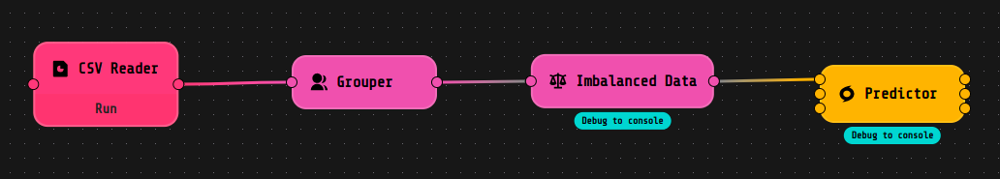
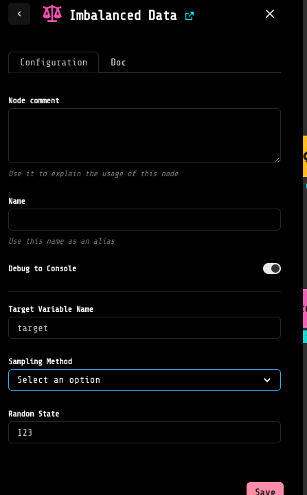
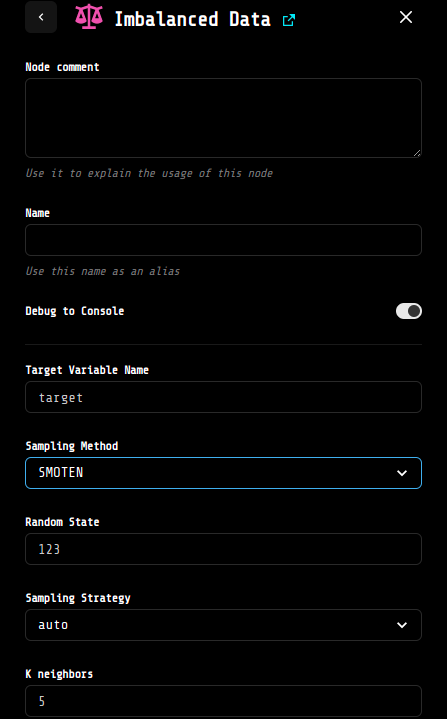

# imbalanced_data_extension
## Description 📝

Balancing a dataset makes training a model easier as it mitigates the risk of the model becoming biased towards a particular class. Imbalanced Data is the LOKO AI block designed to balance your data before passing it to the Predictor block. If you intend to link the Imbalanced Data component to a Predictor, note that you have to untoggle the stream button in the latter component settings.

🔗 Check out the ImbalancedLearn python library documentation to learn more: [Imbalanced Learn API](https://imbalanced-learn.org/stable/references/index.html#api).

## How to Use it 🚀

You can balance your dataset by following these steps:
1. Pass the CSVReader content to the Grouper component (setting a high number as the group size).
2. Link the Grouper's output to the "Balancing" input of the Imbalanced Data component.

## Settings ⚙️

This block includes several fields to be set:

- **Target Variable Name**: By default, the value is "target," representing the name of the variable to consider as the target for sampling.
- **Sampling Method**: Choose among the 4 available sampling methods - undersampling, oversampling, SMOTE (Synthetic Minority Oversampling Technique), and SMOTEN (Synthetic Minority Over-sampling Technique for Nominal). The default method used is undersampling.
- **Random State**: You can set the random state to use.

Based on the chosen sampling strategy, you may find other fields:

- **Sampling Strategy**: This field is present independently of the chosen sampling method. It represents the resampling strategy to adopt. For example, choosing "minority" will imply resampling only the minority class, "not minority" will resample all classes except the minority, and so on.
- **k_neighbors**: This value can be set only for the synthetic-based techniques (i.e., "SMOTE," "SMOTEN"), and it represents the number of nearest neighbors used to define the neighborhood of samples used to generate the synthetic samples.
- **Sample with replacement**: This field is available to be set only for the "undersampling" method. If toggled, the sample will be with replacement of the extracted sample; otherwise, without.

  
  

Feel free to contribute to this project by raising issues or submitting pull requests. Let's make our models more accurate and unbiased together! 🤝

